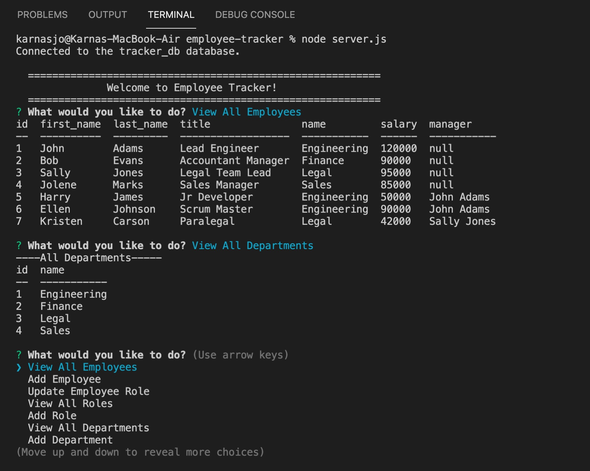

# Homework 12: employee-tracker

## Table of Contents
* [Description](#description)
* [Installation](#installation)
* [Usage](#usage)
* [License](#license)
* [Contributing](#contributing)
* [Questions](#questions)
* [Examples](#examples)
  
## Description
The objective of this assignment is to create an application that runs on node that connects to a database and allows the user to view, add, and update the data in the database. 

To start, I created a schema and seeds file to prepopulate my database with the required tables that link to each other. Next, I worked in MySQL Workbench to determine all of the queries that would be required for the project. Finally,  I created my functions using Inquirer to prompt the user with quetsions. 

## Installation
Clone the project to your local computer than run an npm install.

## Usage
To use this project, first make sure to create the database by coping the schema and seeds files in the db folder to MySQL Workbench or other similar application. Next, type "npm install" in your terminal to install all the dependencies. Finally, type "node server.js" in the terminal and respond to all the prompts.

## License
This project is licensed through MIT.

## Contributing
Please reach out to me if you would like to contribute to my project by email.

## Questions
If you have any questions, please contact me at sjobergkarna@gmail.com or on GitHub with this link [kesjoberg](https://github.com/kesjoberg).

## Screenshot of my deployed paged

## Link to GitHub Repository
https://github.com/kesjoberg/note-taker
 
